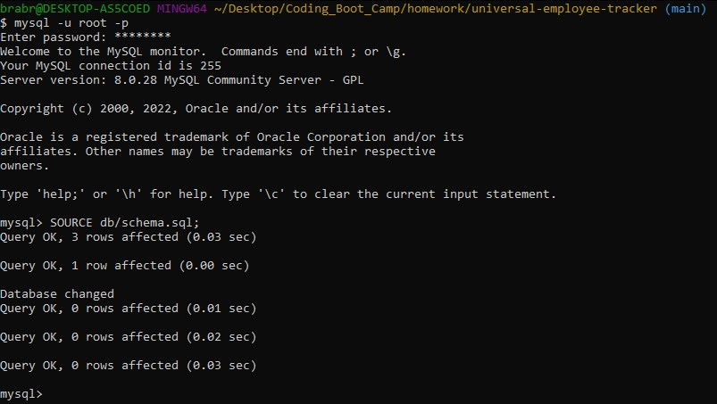
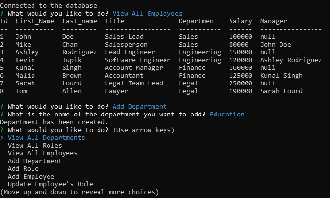

# universal-explicit-employee-tracker

The objective of this app is to manage employees through a content management system (CMS). This app is run in the terminal on the command line via `npm start` after the packages have been installed and the database has been created.

## Getting Started

These instructions will get you a copy of the project up and running on your local machine for development and testing purposes.

### Prerequisites

The user needs to install Node.js in order to utilize the commands to operate the application.
Instructions on how to install can be found here: [Installing Node](https://nodejs.org/en/download/)

They also need to install MySQL since the application will use databases and MySQL methods.

### Installing

User needs to run `npm install` to install the `inquirer`, `mysql2`, and `console.table` packages.

The user needs to login to their MySQL within the directory to create the initial database. Run `SOURCE schema.sql;` to initialize the database and tables. Ensure you had the appropriate pathing to the file from where you establised a connection. (Ex. `SOURCE db/schema.sql;`). The seeds.sql file is optional to execute if you want to test using premade data values.

The user can exit out of MySQL and proceed to run the application.

User can then run `npm start` to run the application.

## Built With

* [Javascript](https://developer.mozilla.org/en-US/docs/Web/JavaScript)
* [Node.js](https://nodejs.org/en/docs/)
* [Inquirer Package](https://www.npmjs.com/package/inquirer)
* [console.table Package](https://www.npmjs.com/package/console.table)
* [MySQL2 Package](https://www.npmjs.com/package/mysql2)

## Video Explanation & Demonstration

The video focuses on the perspective of the user.

* [Video Demonstration](https://watch.screencastify.com/v/TCLlyQn3yoVLoPCf9vo4)
* [Video Demonstration - Continued](https://watch.screencastify.com/v/Q0luJZ5AD0Su7jjL2rM7)

## Screenshots

* 

This is an example of what the user has to do on their command line to establish a database to run the application on.

* 

This is an example of a user selecting the option to display the current employees' information as well as creating a new department.

## Authors

* **Bradley Le** 

- [Link to Portfolio Site](https://pentazoned.github.io/portfolio-v2/)
- [Link to Github](https://github.com/PentaZoned)
- [Link to LinkedIn](https://www.linkedin.com/in/bradley-le-/)

## License

This project is licensed under the MIT License 